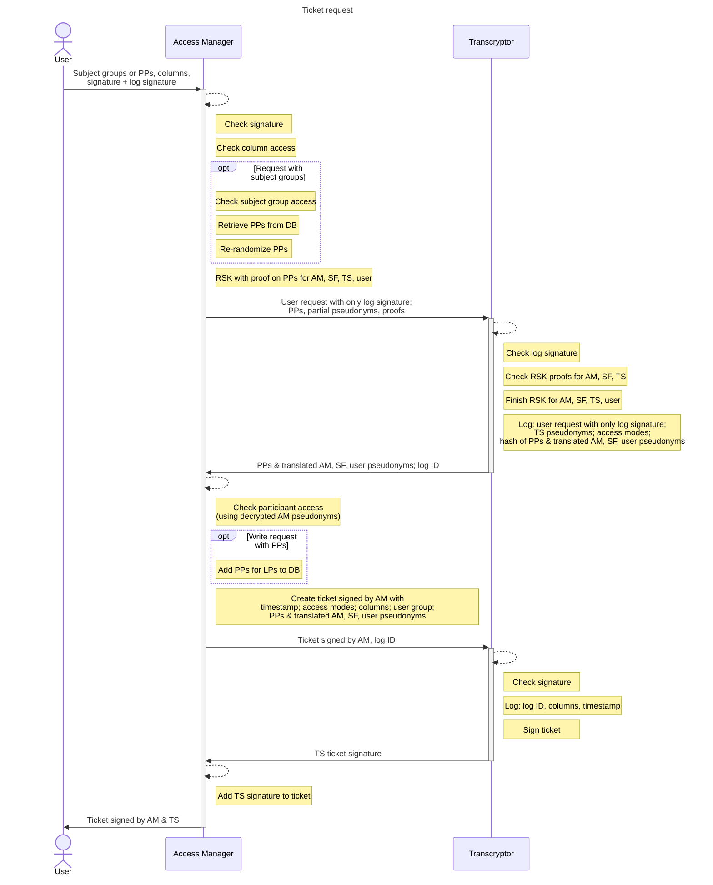

# Ticket request

A user requests a ticket for access to certain participants and columns. They either specify a list of subject groups or polymorphic pseudonyms.
The servers will translate the PPs and return encrypted local pseudonyms for servers and the user in the ticket.
The ticket can be presented to e.g. the Storage Facility later on.

