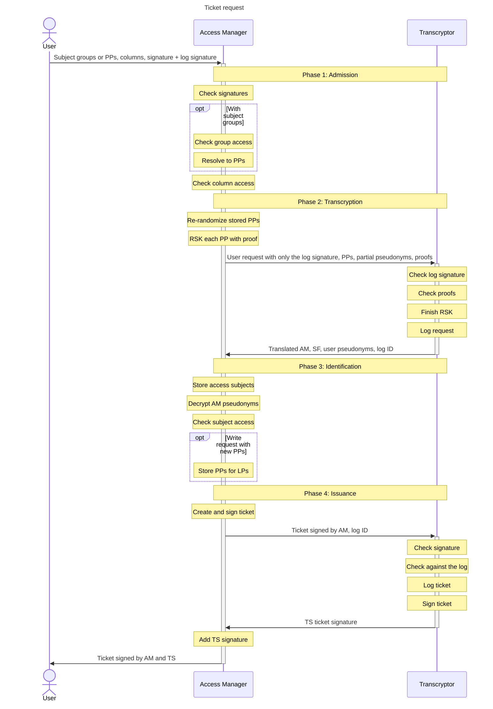

# Ticket request

A user requests a ticket for access to certain data subjects and columns.
They either specify a list of subject groups or polymorphic pseudonyms (PPs).
The Access Manager (AM) and the Transcryptor (TS) will translate the PPs and
return encrypted local pseudonyms (LPs) for the servers and the user in the ticket.
The ticket can be presented to e.g. the Storage Facility (SF) later on.

Processing a ticket request is done in four phases:

| Phase | Name | Summary | TS involved |
| ----- | ---- | --- | --------------------- |
| 1 | Admission | Initial acceptance of the request | No |
| 2 | Transcryption | Translating the pseudonyms | Yes |
| 3 | Identification | Check access on requested subjects | No |
| 4 | Issuance | Create and return a valid ticket | Yes |

The AM can never issue a valid ticket on its own.
The TS needs to be involved in phase 2 to translate the pseudonyms,
and then again in phase 4 to co-sign the ticket.

```mermaid
sequenceDiagram
  title Ticket request
  actor User
  participant AM as Access Manager
  participant TS as Transcryptor

  User->>+AM: Subject groups or PPs, columns, signature + log signature

  Note over AM,TS: Phase 1: Admission
  Note over AM: Check signatures
  opt With subject groups
    Note over AM: Check group access
    Note over AM: Resolve to PPs
  end
  Note over AM: Check column access

  Note over AM,TS: Phase 2: Transcryption
  Note over AM: Re-randomize stored PPs
  Note over AM: RSK each PP with proof
  AM->>+TS: User request with only the log signature, PPs, partial pseudonyms, proofs
  Note over TS: Check log signature
  Note over TS: Check proofs
  Note over TS: Finish RSK
  Note over TS: Log request
  TS->>-AM: Translated AM, SF, user pseudonyms, log ID

  Note over AM,TS: Phase 3: Identification
  Note over AM: Store access subjects
  Note over AM: Decrypt AM pseudonyms
  Note over AM: Check subject access
  opt Write request with new PPs
    Note over AM: Store PPs for LPs
  end

  Note over AM,TS: Phase 4: Issuance
  Note over AM: Create and sign ticket
  AM->>+TS: Ticket signed by AM, log ID
  Note over TS: Check signature
  Note over TS: Check against the log
  Note over TS: Log ticket
  Note over TS: Sign ticket
  TS->>-AM: TS ticket signature
  Note over AM: Add TS signature

  AM->>-User: Ticket signed by AM and TS
```

Some details that were not captured in the diagram:

- The RSK proofs cover the Access Manager, Storage Facility, Transcryptor,
  and, if requested, the user.
- The per-subject access check in phase 3 is skipped if the user group is `DataAdministrator`
