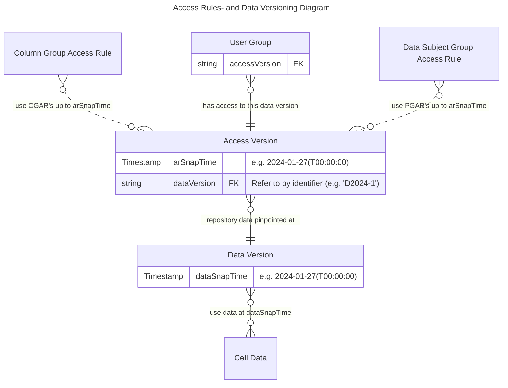

# Generated by filtering timestamp_bound_access-erd.md on %%MINIMAL
# Timestamp Bound Access ERD

Entity relations for Timestamp Bound Access configuration. Technical basis for feature development.

