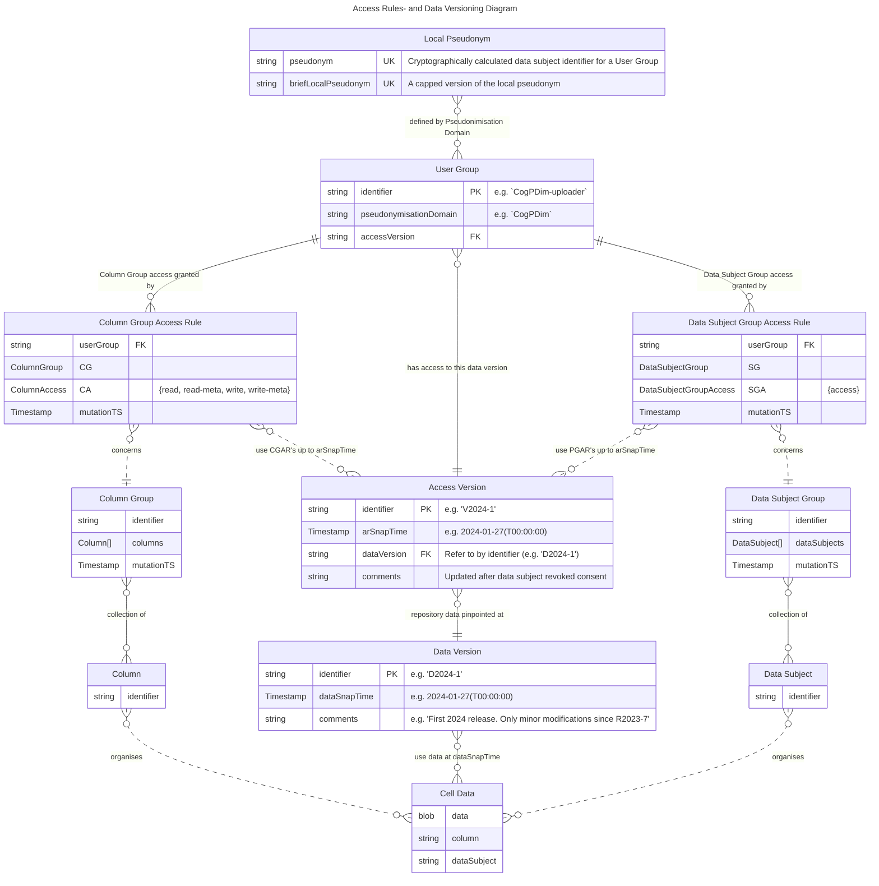

# Timestamp Bound Access ERD

Entity relations for Timestamp Bound Access configuration. Technical basis for feature development.

```mermaid
---
title: Access Rules- and Data Versioning Diagram
---

erDiagram

%% %%MINIMAL TAG exports minimalised version of graph (for overview purposes)
%% Minimalise using script: %CORE%/scripts/docs_subset_filter.sh -O export/timestamp_bound_access-erd-minimal_export.md timestamp_bound_access-erd.md  %%MINIMAL

%%MINIMAL

  "Local Pseudonym" {
    string pseudonym UK "Cryptographically calculated data subject identifier for a User Group"
    string briefLocalPseudonym UK "A capped version of the local pseudonym"
  }

  "Local Pseudonym" }o--o{ "User Group": "defined by Pseudonimisation Domain"
%%MINIMAL
  "User Group" { 
    string identifier PK "e.g. `CogPDim-uploader`"
    string pseudonymisationDomain "e.g. `CogPDim`"
%%MINIMAL
    string accessVersion FK
%%MINIMAL
  }

  %% ACCESS RULE CGAR
  "User Group" ||--o{ "Column Group Access Rule": "Column Group access granted by"
%%MINIMAL
  "Column Group Access Rule" }o..o{ "Access Version": "use CGAR's up to arSnapTime"
%%MINIMAL
  "Column Group Access Rule" {
    string userGroup FK
    ColumnGroup CG
    ColumnAccess CA "{read, read-meta, write, write-meta}"
    Timestamp   mutationTS
%%MINIMAL
  }

%%MINIMAL
  "User Group" }o--|| "Access Version": "has access to this data version"
%%MINIMAL
  "Access Version" {
    string identifier PK "e.g. 'V2024-1'"
%%MINIMAL
    Timestamp arSnapTime "e.g. 2024-01-27(T00:00:00)" 
%%MINIMAL
    string dataVersion FK "Refer to by identifier (e.g. 'D2024-1')"
    string comments "Updated after data subject revoked consent"
%%MINIMAL
  }


  %% ACCESS RULE PGAR
  "User Group" ||--o{ "Data Subject Group Access Rule": "Data Subject Group access granted by"
%%MINIMAL
  "Data Subject Group Access Rule" }o..o{ "Access Version": "use PGAR's up to arSnapTime"
%%MINIMAL
  "Data Subject Group Access Rule" {
    string userGroup FK
    DataSubjectGroup SG
    DataSubjectGroupAccess SGA "{access}"
    Timestamp   mutationTS
%%MINIMAL
  }

  "Column Group Access Rule" }o..|| "Column Group": "concerns"
   "Column Group" {
    string identifier
    Column[] columns
    Timestamp mutationTS
   }

  "Column Group" }o--o{ Column: "collection of"
  Column {
     string identifier
  }
  Column }o..o{ "Cell Data": "organises"

%%MINIMAL
  "Access Version" }o--|| "Data Version": "repository data pinpointed at"
%%MINIMAL
  "Data Version" {
    string identifier PK "e.g. 'D2024-1'"
%%MINIMAL
    Timestamp dataSnapTime "e.g. 2024-01-27(T00:00:00)" 
    string comments "e.g. 'First 2024 release. Only minor modifications since R2023-7'"
%%MINIMAL
  }

%%MINIMAL
  "Data Version" }o--o{ "Cell Data": "use data at dataSnapTime"

%%MINIMAL
  "Cell Data"  {
    blob data
    string column
    string dataSubject
%%MINIMAL
  }

  "Data Subject Group Access Rule" }o..|| "Data Subject Group": "concerns"
  "Data Subject Group" {
    string identifier
    DataSubject[] dataSubjects
    Timestamp mutationTS
  }

  "Data Subject Group" }o--o{ "Data Subject": "collection of"
  "Data Subject" {
     string identifier
  }
  "Data Subject" }o..o{ "Cell Data": "organises"

```

