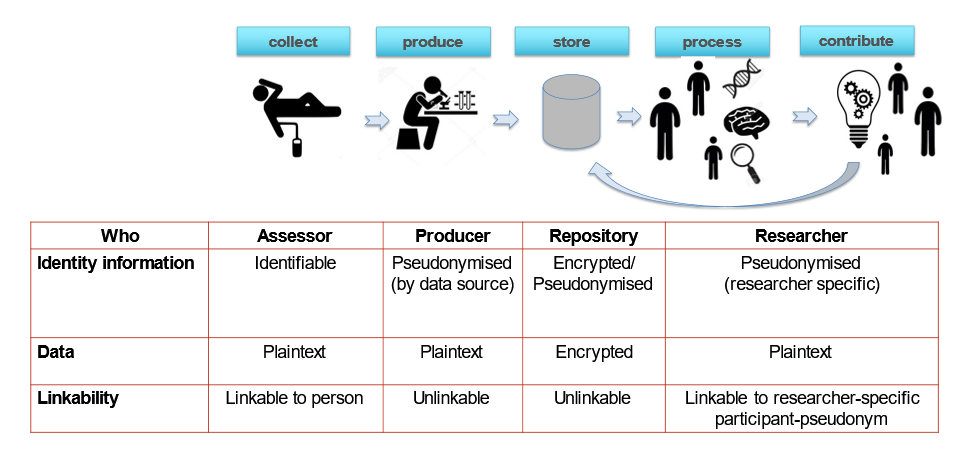

# User roles

> **ℹ️ Info**
>
> This section describes the (conceptual) roles that users have outside the PEP system.
> Usually most of these external roles will be represented internally via **User Groups**.
> It is up to a **Data Administrator** to define these **User Groups** in PEP.

The PEP repository is designed to support the process of collecting, producing and sharing research data obtained from **Data Subjects** such as study participants.
Different groups of people will be involved in different parts of this process and will have different responsibilities.

We use the term **User Role** to mean a combination of responsibilities that can be assigned to a single person or group of persons.

## Implemented roles

The following use cases have been implemented based on this functional design:

### Research Assessor (RA)

A **Research Assessor** is a person collecting data from **Data Subjects**. A **Research Assessor** must know the identity of the **Data Subject** and has access to all the **Reference IDs** used in the data collection phase.

### Monitor (auditor)

A Monitor is a person who audits the data collection process. The monitor has access to all the **Reference IDs*** used in the data collection phase, but not to the identifying data.

### Data Producer (contributor)

A Data Contributor is a person who produces data from collected materials and tests, and who – after quality control and data pseudonymisation – uploads this data to the PEP data repository. A data producer has access to the (short) pseudonyms of the data involved, but not to the identifying information.  Note: in case of derived data (data produced from data obtained from the repository), the Data Contributor can also have the role of Data analyst. In the case of derived data, the Data Contributor data is stored using the **Brief Local Pseudonym**.

### Data Analyst (researcher)

A Data Analyst is a person who is granted access to (a subset of) data from the PEP-repository. A Data Analyst can download and decrypt data to a data processing environment.

### Data Administrator (DA)

The Data Administrator is a person responsible for maintaining the data catalog, and management of metadata such as columns, column groups, participants, and participant-groups in the PEP repository.

### Access Administrator (AA)

The **Access Administrator** is a person who manages **Users**, user authentication, **User Groups** and grants access for a **User Group** to **Column Groups** and **Subject Groups**. Access is granted based on formal requests by the data controller as defined by the GDPR.

### Data Subject (e.g. a study participant)

A participant is a person participating in a research project, providing personal data based on informed consent.

### Data Controller

The natural or legal person who determines the purposes and means of the processing of personal data; In the case of research data this role is generally held by the Principal Investigator.

<!-- The interfaces have been designed on the basis on the use cases and feedback received from actual and potential users. Interfaces have been linked to basic structures and workflow processes in PEP.  The description in this document is not the description of the technical implementation, but a conceptual description, with emphasis on the user view of the system. -->