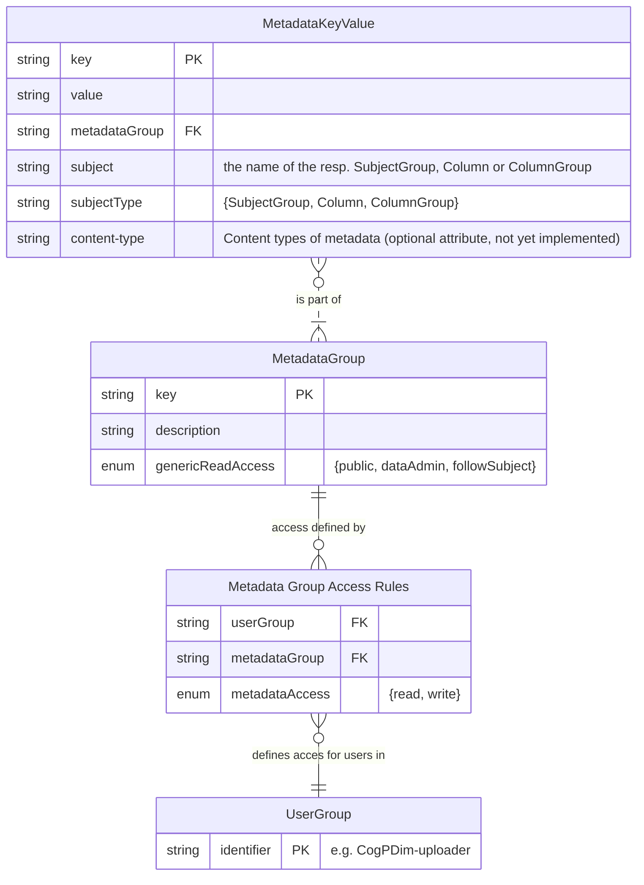

# Repository Data Structure

## Two dimensional table concept

On a conceptual level, PEP data can be envisioned as a two-dimensional table, where each cell is defined by a row-ID and a column-ID:

| Rows ↓ |  Column (1) | Col (2) | Col (3) | Col (...) | Col (n) |
|------|-------------|-------------|-----------|-------------|-------------|
| Pseudonym (1) |  |  |  |  |  |
| Pseudonym (2) |  |  |  |  |  |
| Pseudonym (3) |  |  |  |  |  |
| Pseudonym (...) |  |  |  |  |  |
| Pseudonym&nbsp;(n) |  |  |  |  |  |

On the rows of the repository table are the **Data Subjects** (e.g. study participants), which are referred to by **Polymorphic Pseudonyms (PP)**. During data download, users (such as data analysts) will get a **Brief Local Pseudonym** as identifier for a row. Local Pseudonyms are unique for the **User Group** (e.g. a research group) the **User** belongs to (and can therefore not be exchanged with users from different **User Groups**). They can be very long, and can therefore be shortened (and prefixed) to a Brief Local Pseudonym that is easier to work with. A single **Data Subject** is identified by the **Brief Local Pseudonym** as a stable identifier for use by the **User Group** involved (which is persistent: it does not change in a new PEP session). This is elaborated in more detail the section about pseudonyms below. In this model a cell does not represent a single file but multiple versions of this file.

For registration of a new **Data Subject** (row) and data collection, a specific **Origin ID** is used. **Origin IDs** can be generated by the PEP Repository's registration server, in the form of a unique and unpredictable number (no serial number). When using the `pepcli register` function, the **Origin ID** will be stored in the `ParticipantIdentifier` column in PEP, together with the `Name` and `Date of Birth` of the registered subject. Both values are used in the pepAssessor client application.

## Origin ID

The **Origin ID** is used for several purposes:

* During the registration process it serves as a seed for generating **Polymorphic Pseudonyms**.
* It can be stored in the source environment (e.g. using a CRM) to ensure verification and feedback processes during data collection for data-streams identified by PEP-pseudonyms.
* It is stored in the PEP Repository as a data element to enable re-identification in case of incidental findings.
  * The **Origin ID** is only available to roles that require and justify identification of the **Data Subjects**.
* *Note that after registration of a **Data Subject** the **Origin ID** is **not** used by the PEP Repository system internally for referencing. It is only stored, encrypted, at the Storage Facility (in the **Column** `ParticipantIdentifier`), so it can be accessed by the data source.*

## Columns

The **Columns** in the repository table are defined as a set of cells that have a similar content. A cell is value (e.g. a file) or a set of files, holding this content for a single data subject. Examples of **Columns**:

* A completed consent form
* Sensory data for Week 1, Week 2, Week 3, etc.
* The answers of an online questionnaire
* Scanned forms
* A place of birth
* MRI data
* *etc.*

## Data content

A **Cell** consists of the following data:

* **Cell** coordinates

  * The Local Pseudonym for the PEP Repository Storage Facility.
  * **Column** name.

A **Cell** can have multiple **Cell Versions**.

* A **Cell Version** has:
  * Uploaded completion (timestamp).
  * Encryption values
    * Blinding timestamp (**Column** name and blinding timestamp are used as a base for encryption of the AES key).
    * The (polymorphically encrypted) AES key. The AES key is used to symetrically encrypt the payload data in the **Cell Version**.
  * **Cell Metadata**
    * Placeholder for specific data formats (e.g. MRI)
    * Extension of the file stored in this cell.
  * Audit data (to be implemented)
    * The **User** that uploaded the specific **Cell Version**
  * Payload data
    * May consist of a folder with files, belonging to the same observation or otherwise elementary unit for sharing.

### Structure Metadata

In earlier designs, PEP exclusively supported **Cell Metadata**. **Structure Metadata** makes it possible to add data for structures as **Subject Groups**, **Columns**, **Column Groups** and in the future hopefully also **Users** and **User Groups**. By doing so, new possibilities arise:

* Storing information about how to handle structures with special properties. For example: marking a **Column** that should only be accessible by **Users** in the data source because they contain information that should never be shared with secundary users, for example because they may lead to direct identification of the **Data Subject**. This could lead to a warning to the **Data Administrator** when permitting access such a **Column** to a **User Group**, or even more advance, the server could verify server side if a **User Group** has a flag in its metadata stating it is a **User Group** exclusively accessible for persons in the data source (which in turn could give a warning to the **Access Administrator** when granting access to this **User Group**).
* Storing configurations for user interfaces (e.g. how to format data from a column?) in the PEP Repository. This could allow the design for generic clients, that present their output based on UserGroup permissions and configuration settings that are stored with the data repository.
* Storing scripts or descriptions (e.g. on measurement configurations) alongside the data, that help formatting or interpreting data in the repository.
* Data Catalogue information to be made publicly available or published externally (e.g. what cohort is in a **Subject Group**, or what kind of data is in a **Column (Group)**?).

**Structure Metadata** in this category is always part of a **Metadata Group**. Access to **Structure Metadata** is defined on **Metadata Group**-level, and is described using **Metadata Group Access Rules** (not yet implemented, currently only **Data Administrator** has `write access` to **Structure Metadata** and all users have `read access`).

## Pseudonyms

Pseudonyms are identifiers for data subjects. In PEP, a **Polymorphic Pseudonym** (PP) is used. Polymorphic pseudonyms can be randomized at every step, making a direct comparison of identifiers in different contexts impossible. However, they can be transformed to deterministic local pseudonyms that can be used to identify records.

* A PP is calculated based on the **Origin ID** of the **Data Subject**.
* The so generated PP is stored once **(&bullet;)** at registration time on the Access Manager.
* At the time of data subject registration, a set of **Reference IDs** is generated. These are short, human readable pseudonyms **(&bullet;)** which are connected to a single data source. The **Reference IDs** are stored as regular entries of a specific **Column** (and therefore encrypted) in the PEP Repository **Storage Facility**. These **Reference IDs** have no additional cryptographic functionality.
* The PP is used to produce a set of (encrypted) **local pseudonyms**, which are invariable (stable) once defined, and have a meaning only in the context where they are used (in a decrypted form), such as:
  * A **Local Pseudonym for the User(Group)** is produced from a **Polymorphic Pseudonym** when a User has interaction with the PEP Repository. This **Local Pseudonym** for the User identifies the data subject. The Local Pseudonym for the User is unique for the **User Group**, and it is static over time/multiple downloads. The **Data Administrator** has his own **Pseudonymisation Domain** and therefore his own **Local Pseudonyms**.
  * A **Brief Local Pseudonym**. The Local Pseudonym for the User is shortened for usability reasons, while retaining its uniqueness. Users of the PEP Repository downloading data or uploading derived data will only see and use this **Brief Local Pseudonym**, and no other pseudonyms.
  * A **Local Pseudonym for the Transcryptor**, where it is stored and used to identify all data linked to the same data subject.
  * A **Local Pseudonym for the Storage facility**, where it is stored and used to identify all data linked to the same data subject.
  * A **Local Pseudonym for the Access Manager**, where it is stored and used to perform access control checks matching the pseudonyms (**Subject Groups**) and the usernames to access rules.

  **(&bullet;)** Notes:
  * In a future release the PP will be used only once, initially, to avoid risks involved with storing and reusing the PP.  This means that a translation mechanism between different local pseudonyms will replace the central function of the PP.
  * **Reference IDs** are constructed by combining a random number, an ID for the study (POM), an ID for the visit (1, 2 or 3) or study-related topics and an ID for the sample/**Column** (VS, HQ etc.).  The last 2 digits contain an integrity check of the **Reference ID**. This supports and ensures the correct processing of the data, as opposed to the PP, which is not human-readable and does not fit to stickers used to identify samples.

## Identifiers for uploading data

At the time data need to be uploaded two different paths are available to the user:

1) Users uploading raw data, labeled by a **Reference ID**, use this **Reference ID** as an identifier.  After uploading the data, the **Reference ID** has no further use or significance within PEP.
2) Users uploading derived data (derived from data they have obtained through the PEP system) use the **(Brief) Local Pseudonym** or a **Polymorphic Pseudonym** as an identifier. The **Polymorphic Pseudonym** route may be disabled in the future.
