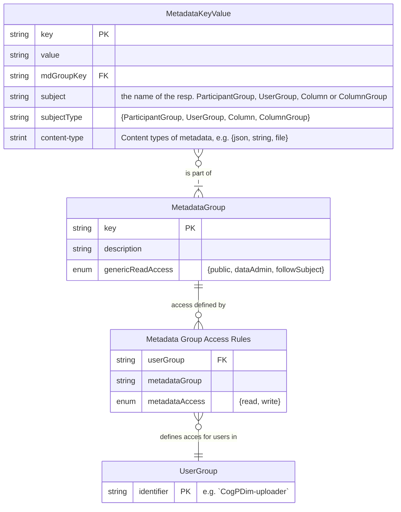

# Repository Data Structure

## Two dimensional table concept

On a conceptual level, PEP data can be envisioned as a two-dimensional table, where each cell is defined by a row-ID and a column-ID:

| Rows ↓ |  Column (1) | Col (2) | Col (3) | Col (...) | Col (n) |
|------|-------------|-------------|-----------|-------------|-------------|
| Pseudonym (1) |  |  |  |  |  |
| Pseudonym (2) |  |  |  |  |  |
| Pseudonym (3) |  |  |  |  |  |
| Pseudonym (...) |  |  |  |  |  |
| Pseudonym&nbsp;(n) |  |  |  |  |  |

The rows of the table represent the participants, identified by a polymorphic pseudonym (PP).   During data download, users (such as data analysts) will get a participant alias as identifier for a row. This al pseudonym is unique for the research group the user belongs to (and can therefore not be exchanged with users from different research groups). A single participant is identified by the participant alias as a stable identifier for use by the user-group involved (which is persistent: it does not change in a new PEP session). This is elaborated in more detail the section about pseudonyms below. In this model a cell does not represent a single file but multiple versions of this file.

For registration of a new participant (row) and data collection, a specific PEP-ID is used. PEP-ID’s are generated by the PEP-system, in the form of a unique and unpredictable number (no serial number).

## PEP-ID

The PEP-ID is used for several purposes:

* During the registration process it serves as a seed for generating the Polymorphic Pseudonym.
* It is stored in the CRM system to ensure verification and feedback processes during data collection for data-streams identified by PEP-pseudonyms.
* It is stored in PEP as a data element to enable re-identification in case of incidental findings.
  * The PEP-ID is only available to the research assessors who need to be in contact with the participants, and the PI (principal investigator) with special permission.
* *Note that after registration of a participant the PEP-ID is not used by the PEP system in any function other than that of a stored data element.*

## Columns

The columns in the table are data-COLUMNS.  A data-COLUMN is defined as a set of files holding data of a single participant that have a similar content. They have identical access rules. Examples of data-COLUMNS:

* Watch data Week 1, Watch data Week 2, Watch data Week 3, …. Watch data week 104.
* UPDRS OFF, UPDRS ON,
* ECG form,
* Home Questionnaire,
* Bam file,
* MRI,
* *etc.*

## Data content

A data card (one entry in a cell) consists of the following data:

* Data card (cell version) coordinates

  * Local Storage Facility Pseudonym (LSFP).
  * Data-COLUMN name.
  * Uploaded completion  (timestamp).

* Encryption values

  * Blinding timestamp (Data COLUMN name and blinding timestamp are used as a base for encryption of the AES key).
  * The (polymorphically encrypted) AES key.

* Metadata (*)

  * Placeholder for specific data formats (e.g. MRI)
  * Extension of the file stored in this cell.

* Audit data
  * Data card uploader User-ID

* Payload data

  * May consist of an archive including several data files, belonging to the same observation.

### (*) Update on metadata

In earlier designs, PEP exclusively supported metadata per cell. By adding metadata for subject types as `Participant Groups`, `Columns`, `Column Groups` and possibly `User Groups`, new possibilities arise:

* Storing configurations for user interfaces (e.g. how to format data from a column?) in PEP. This could allow the design for generic clients, that present their output based on UserGroup permissions and configuration settings that are stored with the data repository.
* Scripts that help formatting or interpreting data from columns, or what describes how all data in the column * Data Catalogue information (e.g. who is in a `Participant Group` or `Column (Group)`?)

`Metadata` in this category is always part of a `Metadata Group`, the basis on which access is described via `Metadata Group Access Rules`.

```mermaid
erDiagram

    MDKV["MetadataKeyValue"] {
        string key PK
        string value
        string mdGroupKey FK
        string subject "the name of the resp. ParticipantGroup, UserGroup, Column or ColumnGroup"
        string subjectType "{ParticipantGroup, UserGroup, Column, ColumnGroup}"
        strint content-type "Content types of metadata, e.g. {json, string, file}"
    }

    MDG[MetadataGroup]
    MDG {
        string key PK
        string description
        enum genericReadAccess "{public, dataAdmin, followSubject}"
    }

    MDKV }o..|{ MDG : "is part of"

    MDGAR["Metadata Group Access Rules"] {
        string userGroup FK
        string metadataGroup
        enum metadataAccess "{read, write}"
    }

    MDG ||--o{MDGAR: "access defined by"
    
    MDGAR }o--||UserGroup: "defines acces for users in"

  UserGroup {
    string identifier PK "e.g. `CogPDim-uploader`"
  }
```

Next to the data entries, metadata exist at the row (Participant) and column (Data-COLUMN) level:

* Participant metadata is data used to manage data collection processes and participant-groups. They are stored as special purpose Data COLUMNS: (mutable, encrypted):
  * Identification data (Name, Date of Birth, PEP-ID). Restricted use: only for
    * Verification of identity by a Research Assessor during data collection visits
    * Reidentification by PI following incidental findings.
  * Test-participant (Boolean, Change User-ID). Shows whether a participant is a test-participant. Restricted use by data-administrator only, to maintain participant groups.
  * Consent (Boolean, Change User-ID). Shows whether consent is present or withdrawn. Restricted use by data administrator only, to maintain participant groups.
* Data-COLUMN metadata (Change User-ID). Show who defined a Data-COLUMN.  

Note: while storing filenames in PEP it should be clear that original filenames (from the source system) of the Research Data are not retained.  PEP cells are identified by a combination of the Local pseudonym for Users and the Data-COLUMN. The standard representation to the user will contain a Participant Alias (a shortened version of the Local Pseudonym for Users), the data-COLUMN, and an extension.

## Data Catalog

The user view of the data takes the form of an authoritative data catalog describing the Data-COLUMNS. The data catalog also contains hierarchies or groupings of Data–COLUMNS that are (often) used in conjunction (a COLUMN-Group). The Data-COLUMNS described in the Data Catalog are stored in PEP. These are the only Data-COLUMNS allowed in the repository. The Data Catalog is not a PEP-component. It describes the resources shared using PEP, and it is maintained by the data administrator.

## Pseudonyms

Pseudonyms are identifiers for participants. In PEP, a **Polymorphic Pseudonym** (PP) is used. Polymorphic pseudonyms can be randomized at every step, making a direct comparison of identifiers in different contexts impossible. However, they can be transformed to deterministic local pseudonyms that can be used to identify records.

* The PP is calculated, based on the PEP-ID of the participant (The Participant ID, also known as the PEP-ID, is randomly generated by PEP and is administered in the CRM).
* The so generated PP is stored once **(&bullet;)** at registration time on the Access Manager.
* At the time of participant registration, a set of **Short Pseudonyms** is generated. These are short, human readable pseudonyms **(&bullet;)** which are connected to a single data source. The Short Pseudonyms are stored as regular entries of a specific Data-COLUMN (and therefore encrypted) in the PEP storage facility. These pseudonyms have no additional cryptographic functionality.
* The PP is used to produce a set of (encrypted) **local pseudonyms**, which are invariable (stable) once defined, and have a meaning only in the context where they are used (in a decrypted form), such as:
  * A **Local Pseudonym for the User** is produced at the time a user downloads data from PEP. This Local Pseudonym for the User identifies participants. The Local Pseudonym for the User is unique for the user-group, and it is static over multiple downloads.  The Data Administrator has his own user-group and therefore his own Local User Pseudonym.
  * A **Participant Alias**. The Local Pseudonym for the User is shortened for usability reasons, while retaining its uniqueness.  This shortened Local Pseudonym for the User is called the Participant Alias.  Users of the PEP system downloading data or uploading derived data will only see and use this Participant Alias, and no other pseudonyms.
  * A **Local Pseudonym for the Transcryptor**, where it is stored and used to identify all data linked to the same participant.
  * A **Local Pseudonym for the Storage facility**, where it is stored and used to identify all data linked to the same participant.
  * A **Local Pseudonym for the Access Manager**, where it is stored and  used to perform access control checks matching the pseudonyms (participant-groups) and the usernames to access rules.

  **(&bullet;)** Notes:
  * In a future release the PP will be used only once, initially, to avoid risks involved with storing and reusing the PP.  This means that a translation mechanism between different local pseudonyms will replace the central function of the PP.
  * Short Pseudonyms are constructed by combining a random number, an ID for the study (POM), an ID for the visit (1, 2 or 3) or study-related topics and an ID for the sample/Data COLUMN (VS, HQ etc.).  The last 2 digits contain an integrity check of the Short Pseudonym. This supports and ensures the correct processing of the data, as opposed to the PP, which is not human-readable and does not fit to stickers used to identify samples.

## Identifiers for uploading data

At the time data need to be uploaded two different paths are available to the user:

1) Users uploading raw data, labeled by a **Short Pseudonym**, use this Short Pseudonym as an identifier.  After uploading the data, the short pseudonym has no further use or significance within PEP.
1) Users uploading derived data (derived from data they have obtained through the PEP system) use the **Participant Alias** as an identifier.
