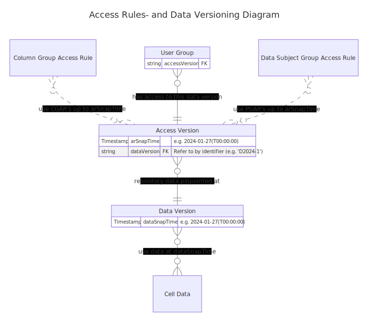

# Data Access

## Authentication

During the logon process, a **User**'s identity is validated by the authentication process, after which the **User** assigns/is assigned to a single **User Group** for the session with PEP. To change **User Groups**, the **User** can simply log out and log in again.

## Access Rules (overview)

**Access Rules** (authorizations) apply to **User Groups** (only). **Users** in the same **User Group** share the same permissions and they share a [Pseudonymisation Domain](#pseudonymisation-domains) (i.e., they obtain the same **(Brief) Local Pseudonyms**). It is possible to address the same **Pseudonymisation Domain** to more than one **User Groups** if it is specifically required to share **(Brief) Local Pseudonyms** in between these **User Groups**.

An **Access Rule** can either grant access to either a whole **Data Subject Group** or **Column Group**. A **User Group** can only access those **Cells** for which it has access to _both_ the **Data Subjects** and **Columns** via these groups.

**Access Rules** are versioned, just like **Cells**: the system stores their entire change history and can reconstruct their state for any given point in time in the past.

A **User Group** has access to one (and only one) **Access Version**, which defines from which point in time the system should retrieve the **Access Rules**. An **Access Version** also relates to a **Data Version**, defining the point in time to retrieve **Cell Versions** from.

An **Access Rule** for a **Column Group** (so called **Column Group Access Rules**) grants one of four types of privileges (**Access Modes**):

### Access Modes

* the `read` privilege allows the **User Group** to read accessible data (**Cell Versions**) in the **Column Group**.
* the `read-meta` privilege allows the **User Group** to retrieve **Cell Metadata**, which contains information about data (**Cell Versions**) in the **Column Group**, but (without the `read` privilege) not to read the data itself. Using this privilege, users can e.g. determine how many cells are non-empty, or when a **Cell Version** has been last uploaded to a specific **Cell**. When the `read` privilege is granted, the `read-meta` privilege is implied.
* the `write` privilege allows the **User Group** to write (upload) new **Cell Versions** to accessible **Cells** in the **Column Group**. Based on the `write` privilege, **Cell Metadata** is written for this new **Cell Version** only.
* the `write-meta` privilege allows the **User Group** to overwrite **Cell Metadata** in the **Column Group** _without_ uploading new **Cell Versions**. This can be used to retroactively store information (such as e.g. a file extension) for data that has been previously uploaded with or without such information. When the `write-meta` privilege is granted, holders automatically receive the `write` privilege as well. (Note: there is no such relation between the `read` and `read-meta` privileges).

Multiple access rules may be defined for the same **Column Group**, e.g. to grant both `read` and `write` privileges to a **User Group**. All **Column Group** privileges apply to all (accessible) cells in all **Columns** that are included in that **Column Group**.

Whether **Cells** are accessible to the **User Group** also depends on the permissions on the **Data Subject**, which are described by **Access Rules** for **Data Subject Groups** (so called **Data Subject Group Access Rules**), for which the only available **Access Mode** privilege is `access` (NOTE: technically, currently the `enumerate` **Access Mode** also exists and has to be granted as well for legacy reasons. This **Access Mode** will be removed in a future release).

## Authorization Contexts

An **Authorization Context** is the combination of the **Data Subject Groups** and the **Column Groups** that a specific **User Group** has access to, according to the **Access Modes** specified by [Access Rules](./3-repository_data_structure#access-rules). `read` and/or `write` access to cells is defined on **Column Group** level per **User Group**.

In the example shown in the table below, the **Authorization Context** is defined as access (of any kind) to the columns labeled 2, 4 and 5 and for the participants (rows) with pseudonyms 2, 5 and 7. Such access is granted indirectly via **Column Groups** and **Data Subject Groups**.

This **Authorization Context** would thereby grant access to the cross sections as labeled with a `1`. The type of access per cell with a `1` depends on the **Access Mode** (see [Access Modes](./3-repository_data_structure.md#access-modes)) associated with the parent **Column Group**. **Access Modes** are ignored in this example.

| Rows ↓            | Column (1)   | **Col (2)*** | Col (3)   | **Col (4)*** | Col (...) | Col (n)   |
|-------------------|--------------|--------------|-----------|--------------|-----------|-----------|
| Pseudonym (1)     | x            | **x**        | x         | **x**        | x         | x         |
| **Pseudonym (2)***| **x**        | **1**        | **x**     | **1**        | **x**     | **x**     |
| Pseudonym (3)     | x            | **x**        | x         | **x**        | x         | x         |
| Pseudonym (4)     | x            | **x**        | x         | **x**        | x         | x         |
| **Pseudonym (5)***| **x**        | **1**        | **x**     | **1**        | **x**     | **x**     |
| Pseudonym (6)     | x            | **x**        | x         | **x**        | x         | x         |
| **Pseudonym (7)***| **x**        | **1**        | **x**     | **1**        | **x**     | **x**     |
| Pseudonym (...)   | x            | **x**        | x         | **x**        | x         | x         |
| Pseudonym (n)     | x            | **x**        | x         | **x**        | x         | x         |

This method simplifies administration, but also introduces limitations. One of these limitations is illustrated in [Example: Limitations within Authorization Contexts](./4-A-data_access-example_authorization_contexts_limitations.md).

## Versioning

### Chains of modifications

Many things stored in the PEP Repository are stored using chains of modifications. A first value may be written to a **Cell** (the first **Cell Version**). Subsequently, this data may be rewritten/overwritten or marked cleared/deleted. All of these operations do not delete the original data from the storage, but merely register the mutation at a point in time.

### Cell Versioning

Regular data stored in PEP, via chains of modifications, are stored in **Cells** via **Cell Versions**.

A **Cell** in a PEP Repository is not equivalent to a regular database cell with a single value or file. Instead, each **Cell** is a collection that can contain a number of **Cell Versions** with corresponding timestamps of when the specific mutation was submitted.  The storing of **Access Rules** works similarly.

### Timestamps and Data/Access Versions

A snapshot of all stored **Cell Versions** and **Access Rules** can be defined for a specific resp. **Data Version Timestamp** or **Access Rules Timestamp**, ignoring all modifications after that point in time.

A **Data Version Timestamp** or **Access Rules Timestamp** is part of a resp. **Data Version** or **Access Version**.

Every **User Group** can get access to a single **Access Version**. In turn, each **Access Version** points to a single **Data Version**. This level of indirection makes sense, because the same **Data Version** is likely to be used for several **Access Versions**. Often the set of **Cell Versions** (the actual contents of the dataset) is frozen/published at a certain point in time (the **Data Version Timestamp**). But after that date, it is likely that new **User Groups** should get access to a subset of the **Repository**, so new **Access Rules** have to be created (which then happens _after_ the **Data Version Timestamp**), therefore, the set of **Access Rules** must differ from the set of **Cell Versions** (resp. **Data Version** and **Access Version**). When combined and fixed at a point in time in the past, an _[immutable dataset](#immutable-datasets)_ is defined.

## Immutable datasets

The combination of these timestamps (for Data and Access Versions) defines reproducible immutable datasets at a point in (past) time when downloading.

Absence of either timestamps in **Access Versions** and **Data Versions** would grant the **User Group** access to the latest (rolling) **Access Ruless** or **Cell Versions** in PEP, i.e. datasets that may change over time.

### Version Names

The identification of **Access Versions** and **Data Versions** uses **Version Names**, using a **Access Version Identifier** and a **Data Version Identifier** respectively. The **Access Administrator** manages the **Access Version Identifiers** and **Data Administrator** does so for the **Data Version Identifiers**, where the **Access Version** also includes a reference to the **Data Version** to make **User Group** management more efficient.

## Extended Entity Relation Diagram

The Entity Relation Diagram depicts how **Local Pseudonyms**, **User Groups**, **Access Rules**, **Column (Group)s**, **Data Subject (Group)s** and **Versioning** relate to each other: [(ERD) on Timestamp Bound Access](../concepts/timestamp_bound_access/timestamp_bound_access-erd.md) .

---

## Contributing derived data from an immutable dataset

As mentioned above, the combined timestamps for **Cell Versions** and **Access Rules** define what collection cells, and what versions of these cells, a **User Group** may have `read` access to. In most cases, it is advised to restrict read access to Snapshots in the past, since it gives the source or publisher better control over which users the contents are being shared with. Additionally, downloaded [immutable datasets](#immutable-datasets) can be reproduced at any time.

In many cases the use of shared data may lead to new (derived) data, which can be valuable for other users. In those situations we may want to grant the downloader write access to **Columns** to store this derived data. But, since **Data Versions** cannot differentiate per **Column** per **User Group**, the timestamp of uploaded derived data will always be _after_ the **Data Version Timestamp** (if set) of the accessible dataset. Because of this, uploaders of derived data would never be able to download their own submitted data after uploading for verification. To do so, we _also_ want to provide such **Users** rolling (read) access to the column they have `write` access to.

This situation can be solved by adding the user to two **User Groups**: one for reading/downloading data based on a **Data Version Timestamp**, and another one with rolling access to the column(s) in which to write the derived data. But since the **User** needs to refer to the same participants in both **User Groups**, they will need to use the same **Local Pseudonyms** in both **User Groups**. This is achieved by assigning both **User Gruops** to the same [Pseudonymisation Domain](#pseudonymisation-domains).

## Pseudonymisation Domains

By default, each **User Group** has its unique set of **Local Pseudonyms**. **Local Pseudonyms** are calculated cryptographically based on a unique literal key for the **User Group**. By default, this key is equal to the name of the **User Group**. There may be reasons to rename a **User Group**, for example to avoid confusion with other (new) groups. But the set of **Local Pseudonyms** for the users in the group should remain the same for the group, even after renaming. In this case, the **Pseudonymisation Domain** of the renamed **User Group** can be set to the name of the old **User Group**. **Pseudonymisation Domains** can also be used to have multiple **User Groups** sharing the same set of **Local Pseudonyms**, so a single **User** in several **User Groups** can link the records it has access to from these different **User Groups**.
