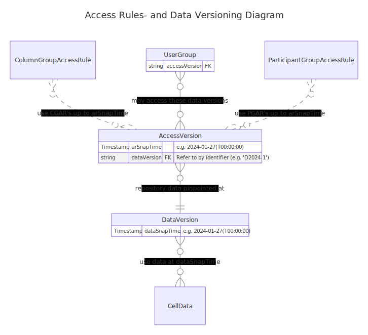

# Data Access Definitions

## Authorization Contexts

An **Authorization Context** is the combination of the **Participant-Groups** and the **Column-Groups** that a specific **User-Group** has access to, according to the `access modes` specified by [Access Rules](./3-repository_data_structure#access-rules).

In the example shown in the table below, the **Authorization Context** is defined as access (of any kind) to the columns labeled 2, 4 and 5 and for the participants (rows) with pseudonyms 2, 5 and 7. Such access is granted indirectly via ColumnGroups and ParticipantGroups.

This **Authorization Context** would thereby grant access to the cross sections as labeled with a `1`. The type of access per cell with a `1` depends on the `access mode` (see [Access Modes](./3-repository_data_structure.md#access-modes)) associated with the parent `ColumnGroup`. ``Access Modes`` are ignored in this example.

| Rows ↓ |  Column (1) | Col (2) * | Col (3) | Col (4) * | Col (...) | Col (n) |
|------|-------------|-------------|-----------|-------------|-------------|--|
| Pseudonym (1) | ❌ | ❌ | ❌ | ❌ | ❌ | ❌ |
| Pseudonym (2) * | ❌ | 1 | ❌ | 1 | ❌ | ❌ |
| Pseudonym (3) | ❌ | ❌ | ❌ | ❌ | ❌ | ❌ |
| Pseudonym (4) | ❌ | ❌ | ❌ | ❌ | ❌ | ❌ |
| Pseudonym (5) * | ❌ | 1 | ❌ | 1 | ❌ | ❌ |
| Pseudonym (6) | ❌ | ❌ | ❌ | ❌ | ❌ | ❌ |
| Pseudonym (7) * | ❌ | 1 | ❌ | 1 | ❌ | ❌ |
| Pseudonym (...) | ❌ | ❌ | ❌ | ❌ | ❌ | ❌ |
| Pseudonym&nbsp;(n) | ❌ | ❌ | ❌ | ❌ | ❌ | ❌ |

## Versioning

### Chains of modifications

Many fields stored in PEP are stored using chains of modifications. A first value may be written to a cell. Subsequently, this data may be rewritten/overwritten or marked cleared/deleted. All of these operations do not delete the original data from the storage, but merely register the mutation at a point in time.

### Data Versioning

Regular data stored in PEP, via chains of modifications, is stored in data cells which are part of the virtual table of `Participants` and `Columns`.

A cell in a PEP Repository is not equivalent to a regular database cell with a single value or file. In contrast, each cell can be seen as a directory that can contain a number of versions with corresponding timestamps of when the specific mutation was submitted. A virtual snapshot of all stored cell data can be defined for a specific `Data Snapshot Timestamp`, ignoring all modifications after that point in time.

### Access Rules (versioning)

The access to `ColumnGroups` and `ParticipantGroups` is registered via so called `Access Rules`. An example implementation of an `Access Rule` could be described as: *"There is a `ColumnGroup` called X where `UserGroup` Y is granted `Access Mode` Z"*. `Access Rules` can be created and removed.

Like cell contents (see [Data Versioning](#data-versioning) ), `Access Rules` are also stored using chains of modifications. `Access Rules` can be modified at any point in time, which would change the access to data for a `User Group` at that point in time. Yet, in many cases, PEP needs to provide static datasets to `User Groups`, and therefore also requires to freeze static sets of access rules for `User Groups`.

### Snapshot Timestamps

This requirement is achieved via `Access Rules Snapshot Timestamps` (see `arSnapTime` attribute of the `Access Version` in the diagram below), that point to the set of `Access Rules` at a fixed/static point in time. `Access Rule Snapshot Timestamps` can be defined per `User Group`. Combined with [Data Versioning](#data-versioning) reproducible immutable datasets can be defined.

## User Access Parameters (Timestamp Bound Access)

To what data a User is granted what type of access depends on all of the following:

* All access is administered at **User Group** level. A **User** can be part of more then one **User Group**, in which case the **User** has to define during the login sequence what **User Group** to use. To change, simply log out and log in again.
* Access Rules define what `Participant Groups` and `Column Groups` a `User Group` has access to. Since these are stored versioned, a **User Group** may have access to the *latest* (sometimes also referred to as *rolling*) version, or to a version of the access rules that correlates with a point in time (timestamp bound access). In this case, the 'snapshot' of the Access Rules as they were at that time defines what access rules the PEP Repository obeys for that User Group. A User Group can *either* have access to a single timestamp of the `Access Rules` *or* to the *rolling* version. This timestamp is referred to as the **Access Rules Snapshot Timestamp** (`arSnapTime` in diagram).
* Similar to the version of the Access Rules, the version of the Repository Data depends on the **Data Snapshot Timestamp** (`dataSnapTime` in diagram). Note that these are two independent timestamps that both define what data a User Group may access.

### Semantic Version Names

The versioning of **Access Rules Snapshot Timestamps** and **Data Snapshot Timestamps** is supported by **Semantic Version Names**, using a **Access Version Identifier** and a **Data Version Identifier** respectively. The **Access Administrator** manages the **Access Version Identifiers** and **Data Administrator** does so for the **Data Version Identifiers**, where the **Access Version** also includes a reference to the **Data Version** to make **User Group** management efficient.

## Extended Entity Relation Diagram

How **Local Pseudonyms**, **User Groups**, **Access Rules**, **Column( Group)s**, **Participant( Group)s** and **Versioning** relate to each other is depicted in the Entity Relation Diagram [(ERD) on Timestamp Bound Access](../concepts/timestamp_bound_access/timestamp_bound_access-erd.md) .

---

## Complex versioning use case: storing data derived from a snapshot timestamp dataset

As mentioned above, Snapshot Timestamps for Data and Access Rules combined define what data cells, and what versions of the data, a legitimate user may have read access to. In most cases, it is advised to restrict read access to Snapshots in the past, since it gives the source or publisher better control over the contents shared with whom, because and downloaded datasets can be reproduced afterwards. But in many cases the usage of shared data may lead to new (derived) data, which can be valuable for other users. In those situations we may want to grant the downloader write access to columns to store the derived data. But, since the `Data Snapshot Timestamps` cannot be differentiated per column, the Snapshot Timestamp at which the data can be read, will be a a point in time before the derived data by this user was stored. Hence: the user is not able to verify whether his own submitted data has been stored at the repository correctly. To do so, this user requires rolling access to the column it has read access to.

This situation can be solver by adding the user to two `User Groups`. One for reading/downloading data based on a Data Snapshot Timestamp, and another one with rolling access to the column(s) in which to write the derived data. But since the user needs to refer to the same participants in both User Groups, it is desired to use the same Local Pseudonyms in both User Groups. This is achieved by using the same [Pseudonymisation Space](#pseudonymsation-spaces) in both User Groups.

## Pseudonymsation Spaces

By default, each `User Group` has it's unique set of `Local Pseudonyms`. `Local Pseudonyms` are calculated cryptographically based on a identifying string for the `User Group`. By default, this string is equal to the name of the `User Group`. There may be reasons to rename a `User Group`, for example to avoid confusion with other (new) groups. But the set of `Local Pseudonyms` for the users in the group should remain the same for the group, also after renaming. Additionally, there are circumstances where a single `User` is part of multiple `User Groups` in all of which the same set of `Local Pseudonyms` is desired. This can be achieved by introducing the `Pseudonymisation Space` for a `User Group`. When a `Pseudonymisation Space` is defined for a `User Group`, this string value is used instead of the `User Group` name. When a `User Group` uses the `Pseudonymisation Space` string equal to the name of another `User Group`, both `User Groups` will receive the same `Local Pseudonyms`. The `Access Manager` is exclusively responsible for performing the `Pseudonymisation Spaces` modifications.

## Example: Limitations within Authorization Contexts

All cells that are part of the `Column Groups` and `Participants Groups` of an `Authorization Context` are included in the `Authorization Context`. If the data subset spanned by Row 2 and Column 3 should be combined with the data subset spanned by Row 5 and Column 7, the subsets spanned by Row 2 and Column 7, and the subset spanned by Row 5 and Column 3 are automatically also part of the `Authorization Context`.

### Example

Subset **A**, is the combination of a Column-Group containing C1 and C2,
and a **Participant-Group** containing P2 and P4.
This gives access to 4 cells:

|        | C1 | C2 | C3 | C4 |
|--------|----|----|----|----|
| **P1** |    |    |    |    |
| **P2** | 1  | 1  |    |    |
| **P3** |    |    |    |    |
| **P4** | 1  | 1  |    |    |

Subset **B**,
is the combination of a Column-Group containing C2 and C3,
and a **Participant-Group** containing P2 and P3.
This also gives access to 4 cells:

|        | C1 | C2 | C3 | C4 |
|--------|----|----|----|----|
| **P1** |    |    |    |    |
| **P2** | 1  |    | 1  |    |
| **P3** | 1  |    | 1  |    |
| **P4** |    |    |    |    |

A user with access to both authorization groups, **A** and **B**, can access all cells where both the column and participant are accessible via either **A** *or* **B**.
This results in access to 9 cells in total, two of which were not accessible via **A** nor **B** (marked `!`):

|        | C1 | C2 | C3 | C4 |
|--------|----|----|----|----|
| **P1** |    |    |    |    |
| **P2** | 1  | 1  | 1  |    |
| **P3** | 1  | 1! | 1  |    |
| **P4** | 1   | 1  | 1! |    |

