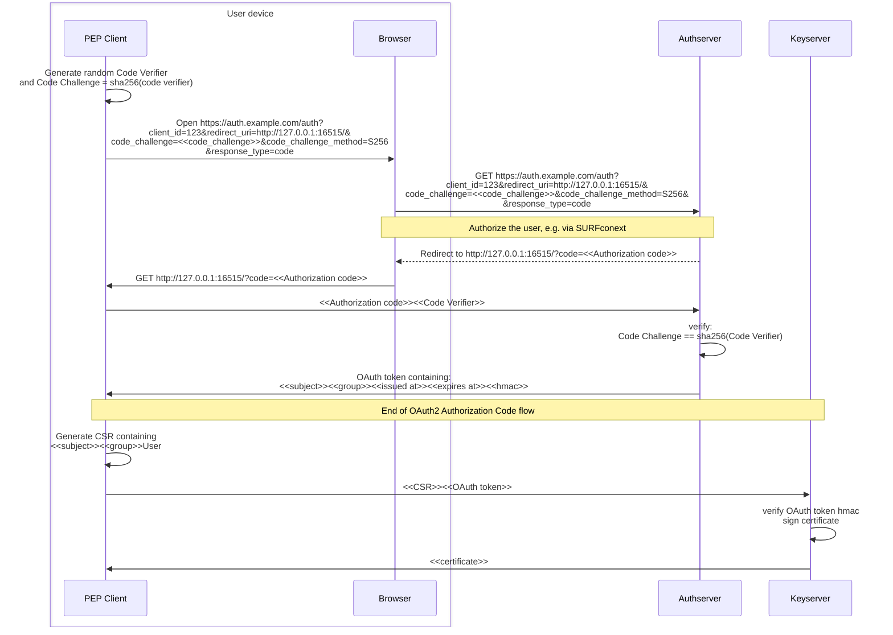

# Authentication Server

## OAuth2 Authorization Code Flow

The applications `pepAssessor` and `pepLogon` use the _Authorization Code Flow_ of OAuth2 ([RFC6749](https://www.rfc-editor.org/rfc/rfc6749))
, with PKCE ([RFC7636](https://datatracker.ietf.org/doc/html/rfc7636)) to communicate with the authserver. This is described in the following sequence diagram:

This leaves out how the user is actually authenticated by the authserver. See [How we use apache](authserver-apache.md) for more details about this.