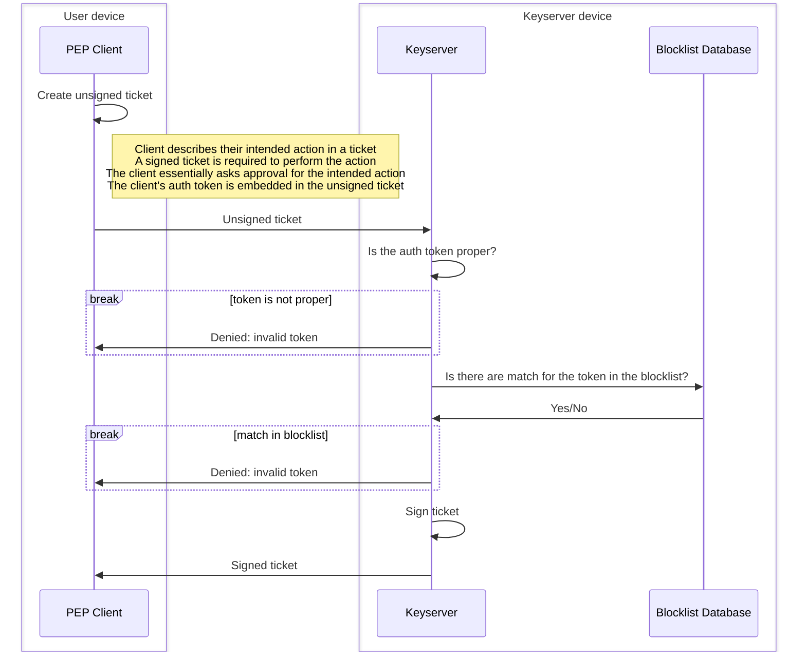

# Keyserver

## Enrolment Request
Most pepcli operations require an approval from the keyserver and when a user calls a command via `pepcli`, a Certificate 
Signing Request (CSR) is sent to the keyserver together with an authentication token.

> ℹ️ **info**
>
> A CSR can be considered to be a request to do an action ("I want to do X"). A token is a proof of identity
> ("I am Y"). When a client sends both a CSR and a token to the keyserver, they are essentially declaring:
> "I am Y and I want to do X". The keyserver can then either approve or deny this request.

The keyserver will check two aspects before it gives an approval:

1. First it checks if the CSR itself is properly constructed and signed and if it has not yet expired. We use there
   term __proper__ for tokens that pass this initial check.
1. After that, it checks if the token is __blocked__, by matching it against entries in a blocklist database.
   A match means that the token is blocked.

A token is __valid__ if passes both checks. In other words, **a token is valid if it is __proper__ and not __blocked__**.
The keyserver will only return a signed certificate (approval), if the token is valid. In all other cases an error 
message is sent back, leaving the client unable to perform any action on PEP.

> ℹ️ **info**
>
> Once a token is created it can no longer be changed. Sometimes there are reasons to no longer accept a token even 
> though the token itself has not yet expired. For example, when the owner of the token has left the project and should
> therefore not have access anymore. For these reasons we introduced a blocklist, which allows users to dynamically and
> remotely invalidate tokens, without having to edit the tokens themselves.

The following diagram shows in more detail what kind of messages are passed between the client and server to perform
the steps outlined in the text above.

## Blocklist Database 

The blocklist SQL database consist of a single table where each row represents a single block rule.
A rule has 3 fields that are used to match against tokens, `targetSubject`, `targetUserGroup` and `targetIssueDateTime`.
In addition to this there are metadata fields that just carry some additional information for bookkeeping.

A rule is considered to match a token if all of the following conditions hold
- the token subject exactly matches the `targetSubject`
- the token user group exactly matches the `targetUserGroup`
- the token was issued _at or before_ the `targetIssueDateTime`

A single rule can match multiple tokens that were issued for the same user and user-group. The only difference between
the matching tokens is the issue date. Typically, only the most recent of these tokens is actually relevant, since they
will all be identical in use, except for the expiration date.

This is the complete list of all columns in the blocklist 
- **id:** A numerical id to identify a specific row (block rule)
- **targetSubject:** The subject (PEP user id) of the blocked tokens
- **targetUserGroup:** The user group of the blocked tokens
- **targetIssueDateTime:** A date and time that is _equal to_ or _after_ the time and date at which the target tokens
  mere created, as PEP timestamp
- **metadataNote:** Freeform text written by the person that added the entry to the table
  to explain why tokens were blocked
- **metadataIssuer:** The user that added the entry
- **creationDateTime:** The date and time at which the entry was created as a PEP timestamp

