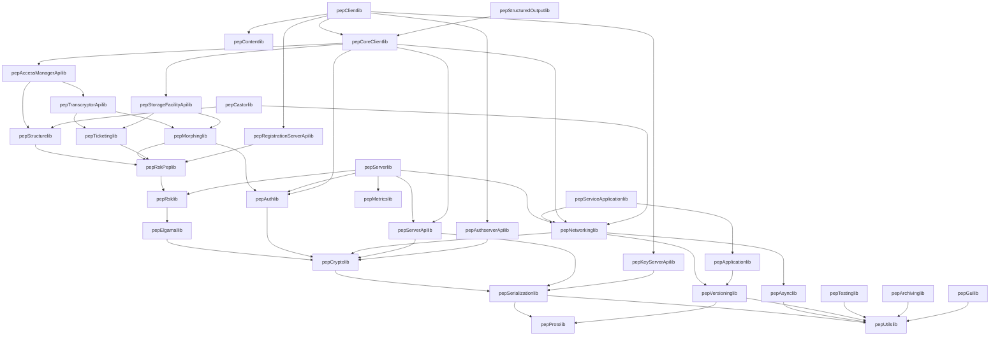

# Library Dependencies

PEP's non-application C++ libraries have the following interdependencies:

```mermaid
flowchart TB
  pepAccessManagerApilib --> pepStructurelib
  pepAccessManagerApilib --> pepTranscryptorApilib
  pepStructurelib --> pepRskPeplib
  pepRskPeplib --> pepRsklib
  pepRsklib --> pepElgamallib
  pepElgamallib --> pepCryptolib
  pepCryptolib --> pepSerializationlib
  pepSerializationlib --> pepProtolib
  pepSerializationlib --> pepUtilslib
  pepTranscryptorApilib --> pepMorphinglib
  pepTranscryptorApilib --> pepTicketinglib
  pepMorphinglib --> pepRskPeplib
  pepMorphinglib --> pepAuthlib
  pepAuthlib --> pepCryptolib
  pepTicketinglib --> pepRskPeplib
  pepServerlib --> pepRsklib
  pepServerlib --> pepAuthlib
  pepServerlib --> pepMetricslib
  pepServerlib --> pepNetworkinglib
  pepServerlib --> pepServerApilib
  pepNetworkinglib --> pepCryptolib
  pepNetworkinglib --> pepAsynclib
  pepNetworkinglib --> pepVersioninglib
  pepAsynclib --> pepUtilslib
  pepVersioninglib --> pepProtolib
  pepVersioninglib --> pepUtilslib
  pepServerApilib --> pepCryptolib
  pepServerApilib --> pepSerializationlib
  pepServiceApplicationlib --> pepNetworkinglib
  pepServiceApplicationlib --> pepApplicationlib
  pepApplicationlib --> pepVersioninglib
  pepTestinglib --> pepUtilslib
  pepArchivinglib --> pepUtilslib
  pepClientlib --> pepAuthserverApilib
  pepClientlib --> pepContentlib
  pepClientlib --> pepCoreClientlib
  pepClientlib --> pepKeyServerApilib
  pepClientlib --> pepRegistrationServerApilib
  pepAuthserverApilib --> pepCryptolib
  pepCoreClientlib --> pepAccessManagerApilib
  pepCoreClientlib --> pepAuthlib
  pepCoreClientlib --> pepNetworkinglib
  pepCoreClientlib --> pepServerApilib
  pepCoreClientlib --> pepStorageFacilityApilib
  pepStorageFacilityApilib --> pepMorphinglib
  pepStorageFacilityApilib --> pepTicketinglib
  pepKeyServerApilib --> pepSerializationlib
  pepRegistrationServerApilib --> pepRskPeplib
  pepGuilib --> pepUtilslib
  pepCastorlib --> pepStructurelib
  pepCastorlib --> pepNetworkinglib
  pepStructuredOutputlib --> pepCoreClientlib
```
