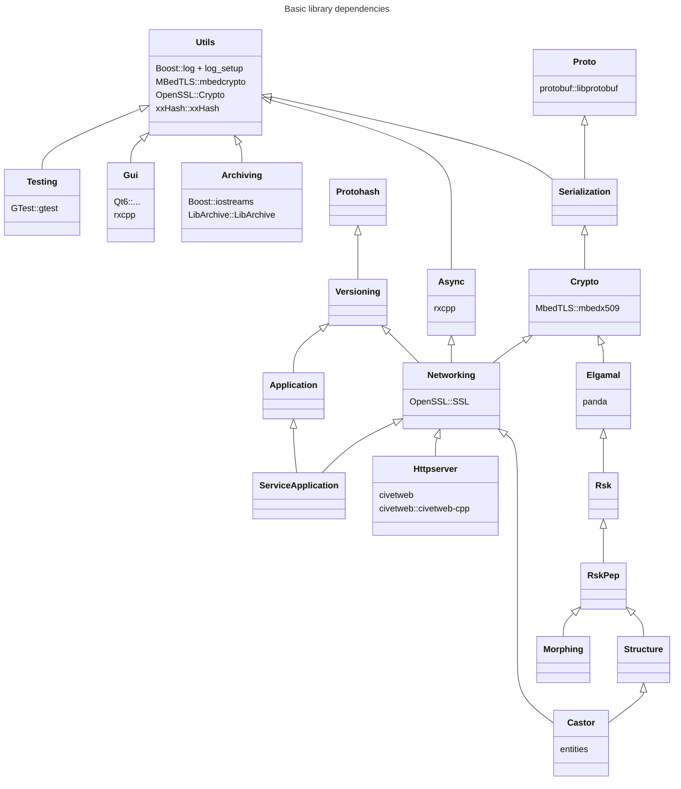
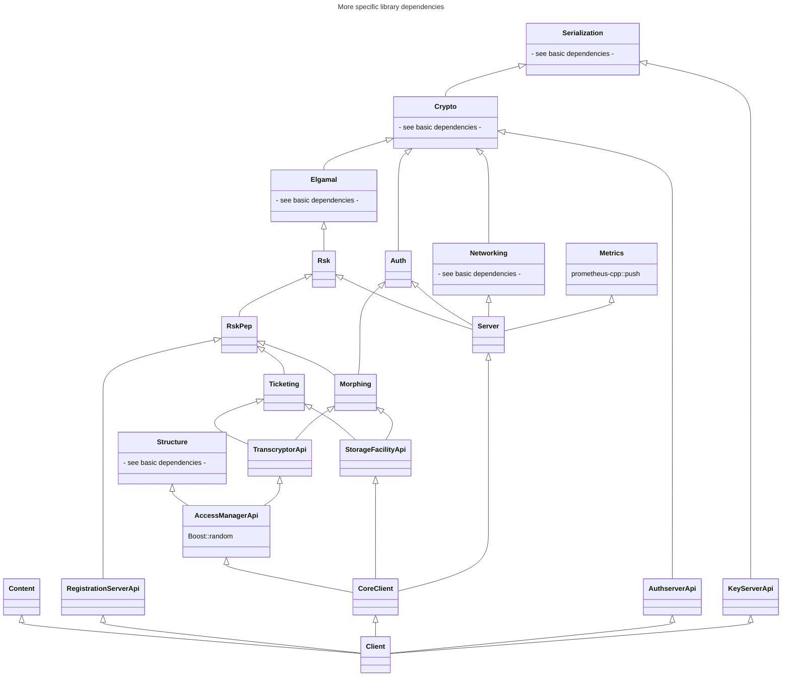

# Library Dependencies

PEP's most basic C++ libraries have the following (inter-)dependencies. See below for more specific (i.e. dependent) libraries.

PEP's more specific (i.e. dependent) libraries have have the following (inter-)dependencies. See above for more basic (i.e. less dependent) libraries.

Server libraries and executable targets have not been graphed.
